# 🩺 MedXpert: An Explainable AI (XAI) Diagnostic Assistant


[](https://www.python.org "Python 3.11")
[](https://docs.pytest.org "Pytest")
[-green.svg)](https://coverage.readthedocs.io "Coverage")
[](https://www.docker.com "Docker")

MedXpert is a full-stack, end-to-end medical imaging system that performs real medical reasoning.

It performs a complete diagnostic workflow:
- **Automatically classifies** X-ray view (Frontal or Lateral)
- **Diagnoses** 14 thoracic pathologies using a specialist model
- **Explains** its predictions with Grad-CAM heatmaps
- **Generates** expert-level clinical summaries for each finding using a Gemini-powered RAG pipeline

This system is built as a production-ready microservice with a dedicated API backend and a Streamlit UI frontend.

---

## 🚀 Live Application Demo


---

## 🎯 Key Features

This project was built to showcase a modern, end-to-end AI engineering stack.

* **🤖 Multi-Stage AI Pipeline:** A lightweight `MobileNetV3` "AI Router" first identifies the X-ray view, then automatically routes the image to one of two specialist `DenseNet-121` models (Frontal/Lateral) for superior accuracy.
* **💡 Explainable AI (XAI):** Generates **Grad-CAM heatmaps** for every positive finding, allowing clinicians to visually verify *why* the model made its decision by highlighting the exact pixels it focused on.
* **📚 GenAI Knowledge Base (RAG):** A 13-document medical knowledge base (built from `StatPearls` and `JAMA` reviews) is stored in a `ChromaDB` vector store. The **Gemini API** synthesizes this information to provide concise, relevant summaries for each diagnosis.
* **🧩 Microservice Architecture:** A decoupled, high-performance **FastAPI backend** (for all AI/RAG logic) and a responsive **Streamlit frontend** (for the UI).
* **🐳 Container-Ready:** The entire application stack (API and Frontend) is fully containerized with **Docker** and orchestrated with **Docker Compose**.
* **✅ Professionally Tested:** The API backend is validated by a comprehensive **Pytest** suite of 114 tests, achieving **96% code coverage** on the main API logic.

---

## 🏗️ System Architecture

The application runs as two separate services that communicate via a REST API. This architecture ensures scalability and separation of concerns.



-----

## 🛠️ Tech Stack

| Component | Technology |
| :--- | :--- |
| **Backend** | FastAPI |
| **Frontend** | Streamlit |
| **AI Models** | MobileNetV3, DenseNet-121 |
| **GenAI / RAG** | Gemini API, ChromaDB, Sentence Transformers (all-mpnet-base-v2) |
| **XAI** | Grad-CAM |
| **Deployment** | Docker, Docker Compose |
| **Testing** | Pytest, Coverage |

-----

## 🚀 How to Run

There are two ways to run this project: locally (for development) or with Docker (for a production-like deployment).

### 1\. Local Development

This is the recommended method for testing and iterating.

**Prerequisites:**

  * Conda (or venv)
  * Python 3.11


1.  **Clone the Repository:**

    ```bash
    git clone https://github.com/your-username/MedXpert.git
    cd MedXpert
    ```

2.  **Set Up Environment:**

      * Create and activate your Conda environment:
        ```bash
        conda create -n medxpert python=3.11
        conda activate medxpert
        ```
      * Install all dependencies:
        ```bash
        pip install -r requirements.txt
        pip install -r requirements-dev.txt
        ```

3.  **Set Up Secrets:**

      * Copy the example environment file:
        ```bash
        copy .env.example .env
        ```
      * Edit the `.env` file and add your `GEMINI_API_KEY`.

4.  **Run the Application:**

      * Open **two terminals** and activate your `(medxpert)` environment in both.

      * **In Terminal 1 (Run Backend API):**

        ```bash
        Makefile.bat run-api
        ```

        *(This runs: `python -m uvicorn src.api:app --reload`)*

      * **In Terminal 2 (Run Frontend App):**

        ```bash
        Makefile.bat run-app
        ```

        *(This runs: `streamlit run src/app.py`)*

5.  **Open the App:**

      * Open your browser and go to **`http://localhost:8501`**.

### 2\. Run with Docker (Production-Ready)


**Prerequisites:**

  * Docker Desktop (must be running)
  * A `.env` file (see Step 3 above)


1.  **Build the Containers:**
    

    ```bash
    docker-compose build
    ```

2.  **Run the Application:**

    ```bash
    docker-compose up -d
    ```

    *(Use `docker-compose up` without `-d` if you want to see the live logs in your terminal).*

3.  **Open the App:**

      * Open your browser and go to **`http://localhost:8501`**.

4.  **To Stop:**

    ```bash
    docker-compose down
    ```

-----

## ✅ Running the Test Suite

This project is built with a focus on quality, achieving **97% test coverage** on the critical API logic and a **100% (114/114) pass rate**.

1.  Activate your environment:
    ```bash
    conda activate medxpert
    ```
2.  Run the test script:
    ```bash
    scripts\run_tests.bat
    ```
3.  A full coverage report will be generated in the `htmlcov/` folder. Open `htmlcov/index.html` to see a detailed, line-by-line breakdown.

-----

## 👤 Author & Contact

**Rishabh Dewangan**

  * **Email:** `rishabhcicdu@gmail.com`

-----

## ⚖️ License

This project is licensed under the MIT License. See the `LICENSE` file for details.